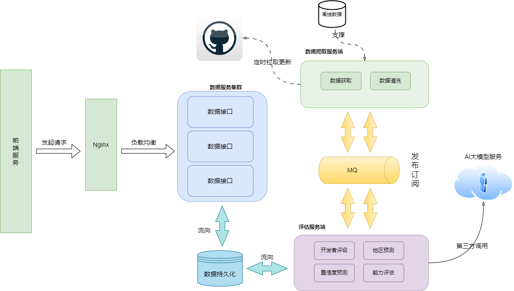

## 1. 项目介绍

本系统旨在基于 GitHub 开源项目数据，开发一款开发者评估应用。系统通过对项目的重要程度、开发者在项目中的贡献度等多个维度进行分析和评估，提供开发者技术能力的评级排名。

### 1.1 系统架构图



### 1.2 核心模块

#### internal/crawler

```go
type GithubCrawler struct {
    client    *github.Client
    rateLimit *redis.Client
    storage   *mongo.Collection
}

func (c *GithubCrawler) FetchUserData(username string) (*models.Developer, error) {
    // 实现 GitHub 数据抓取
    // 包含速率限制处理
    // 错误重试机制
}
```

 internal/models

```go
type Developer struct {
    ID              primitive.ObjectID `bson:"_id,omitempty"`
    Username        string            `bson:"username"`
    Name            string            `bson:"name"`
    Location        string            `bson:"location"`
    Nation          string            `bson:"nation"`
    NationConfidence float64          `bson:"nation_confidence"`
    Skills          []string          `bson:"skills"`
    TalentRank      float64          `bson:"talent_rank"`
    Metrics         DeveloperMetrics  `bson:"metrics"`
    UpdatedAt       time.Time         `bson:"updated_at"`
}
```

#### internal/api

```go
func SetupRoutes(r *gin.Engine) {
    // 健康检查
    r.GET("/health", handlers.HealthCheck)
```

​    

```go
// API 路由组
api := r.Group("/api")
{
    // 开发者相关接口
    developers := api.Group("/developers")
    {
        developers.GET("", handlers.ListDevelopers)
        developers.POST("", middleware.Auth(), handlers.CreateDeveloper)
        developers.GET("/:id", handlers.GetDeveloper)
        developers.PUT("/:id", middleware.Auth(), handlers.UpdateDeveloper)
        developers.DELETE("/:id", middleware.Auth(), handlers.DeleteDeveloper)
    }

    // 搜索接口
    api.GET("/search", handlers.SearchDevelopers)
}
```

## 2. 数据库设计

### 2.1 MongoDB 集合设计

#### developers 集合

```go
// 创建索引
db.developers.createIndex({ "username": 1 }, { unique: true })
db.developers.createIndex({ "nation": 1 })
db.developers.createIndex({ "skills": 1 })
db.developers.createIndex({ "talent_rank": -1 })
db.developers.createIndex({ 
    "username": "text", 
    "name": "text", 
    "location": "text" 
})
```

### 2.2 Redis 缓存设计

```
const (
    // 缓存键模式
    DeveloperCacheKey = "dev:%s"      // 开发者信息缓存
    SearchCacheKey   = "search:%s"    // 搜索结果缓存
    RateLimitKey    = "ratelimit:%s"  // API 限流

    // 缓存过期时间
    DeveloperCacheTTL = 24 * time.Hour
    SearchCacheTTL   = 1 * time.Hour
)
```

## 3. 项目检查清单

### 3.1 代码规范 ✅

遵循 Go 标准项目布局

使用 golangci-lint 进行代码检查

统一的错误处理机制

完善的日志记录

### 4.3 长期改进

服务拆分

引入消息队列

实现分布式追踪

完善测试覆盖率

## 5. 总结

### 存在的问题

安全性措施不足

缓存策略不完善

监控体系缺失

性能优化空间大

### 优先级排序

紧急：安全性问题修复

重要：缓存机制实现

常规：监控系统搭建

长期：架构优化升级

## 4.人员分工

**前端**
李仕骥

#### 职责：

负责与项目团队沟通，理解业务需求，确定系统设计的方向和要求。

负责开发用户界面，确保用户可以直观地查看开发者评估结果。

##### 任务：

1.设计和实现前端页面，包括但不限于首页、搜索页、结果展示页等。

 2.实现前端的交互逻辑，如模糊搜索、领域分类、地区分类等。 

3.确保前端界面的响应式设计，适配不同设备和屏幕尺寸。

4.与后端服务进行接口对接，确保数据的准确传输和展示。 

5.参与设计数据库模型和API接口，确保数据的持久化和一致性。

6.参与系统架构设计，确定系统的模块划分和通信方式。

**后端**

徐瑞

#### 职责：

负责后端业务逻辑的实现，包括API的开发和内部服务的逻辑处理

负责设计数据库表结构，确保数据的组织方式能够高效支持业务需求。

##### 任务：

1. 设计表结构，包括字段定义、数据类型、索引等。
2. 确保表结构的规范化，减少数据冗余，提高数据一致性。
3. 参与参与系统架构设计，确定系统的模块划分和通信方式。
